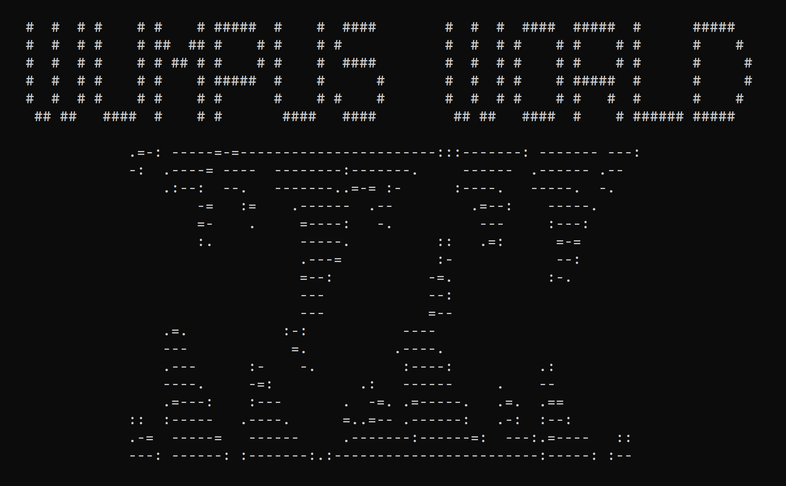
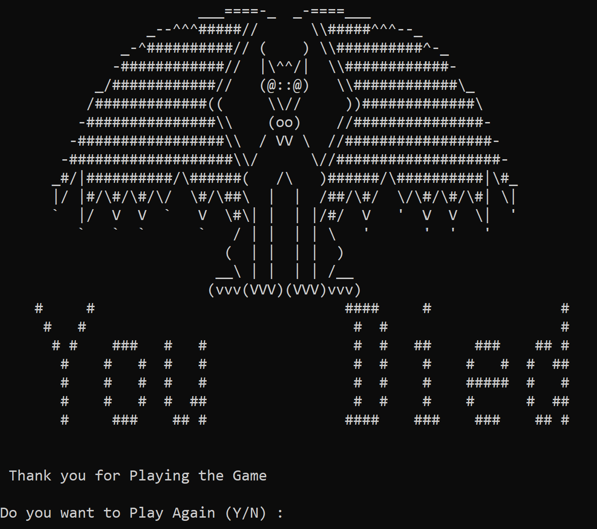
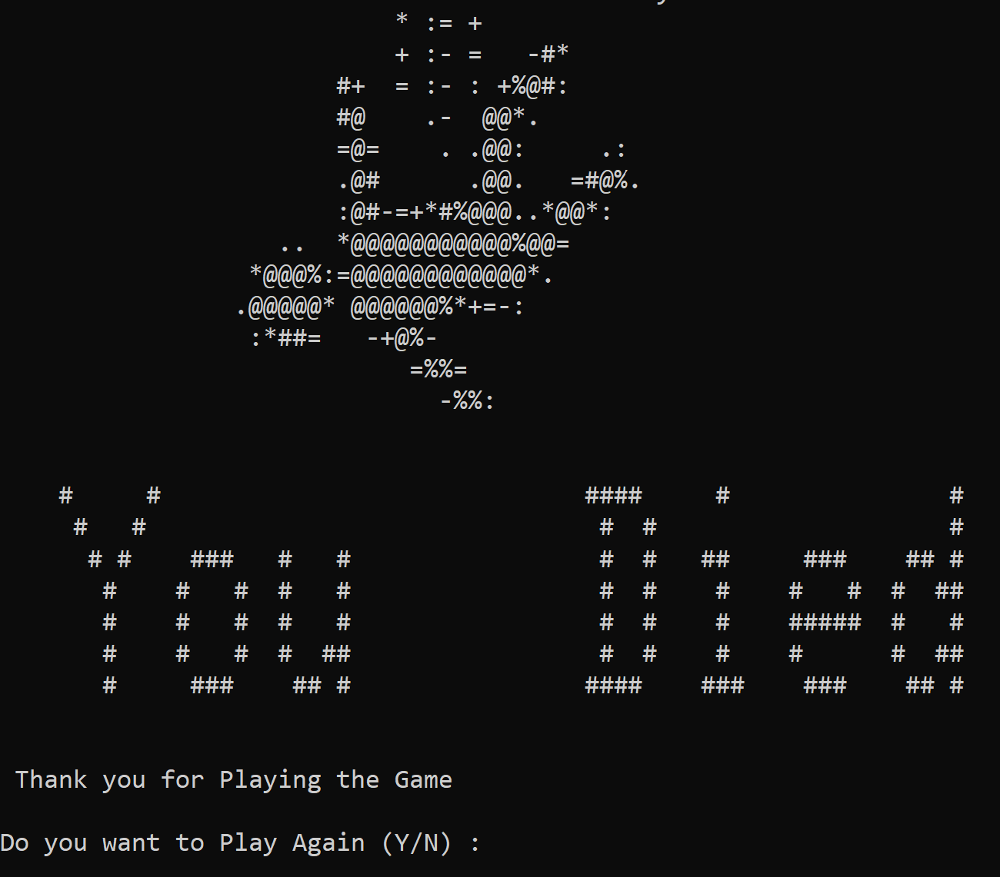
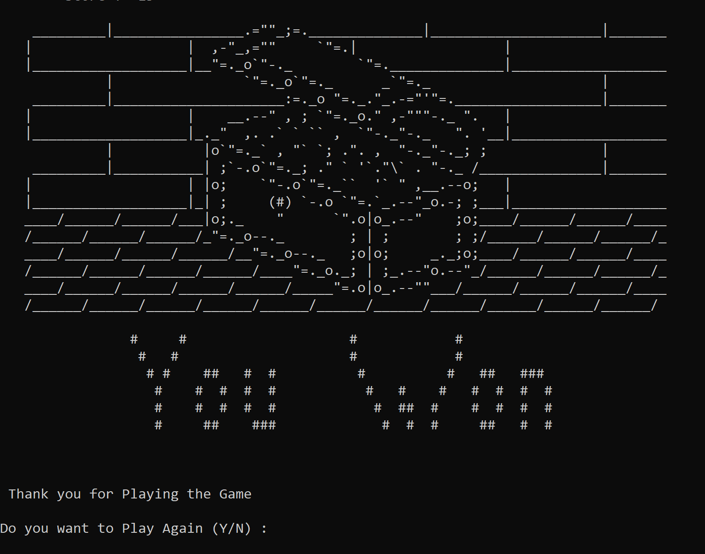
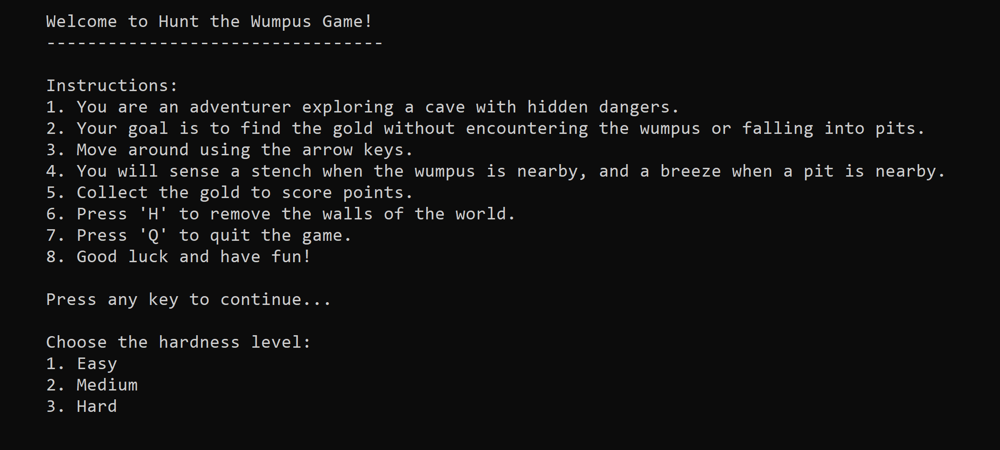
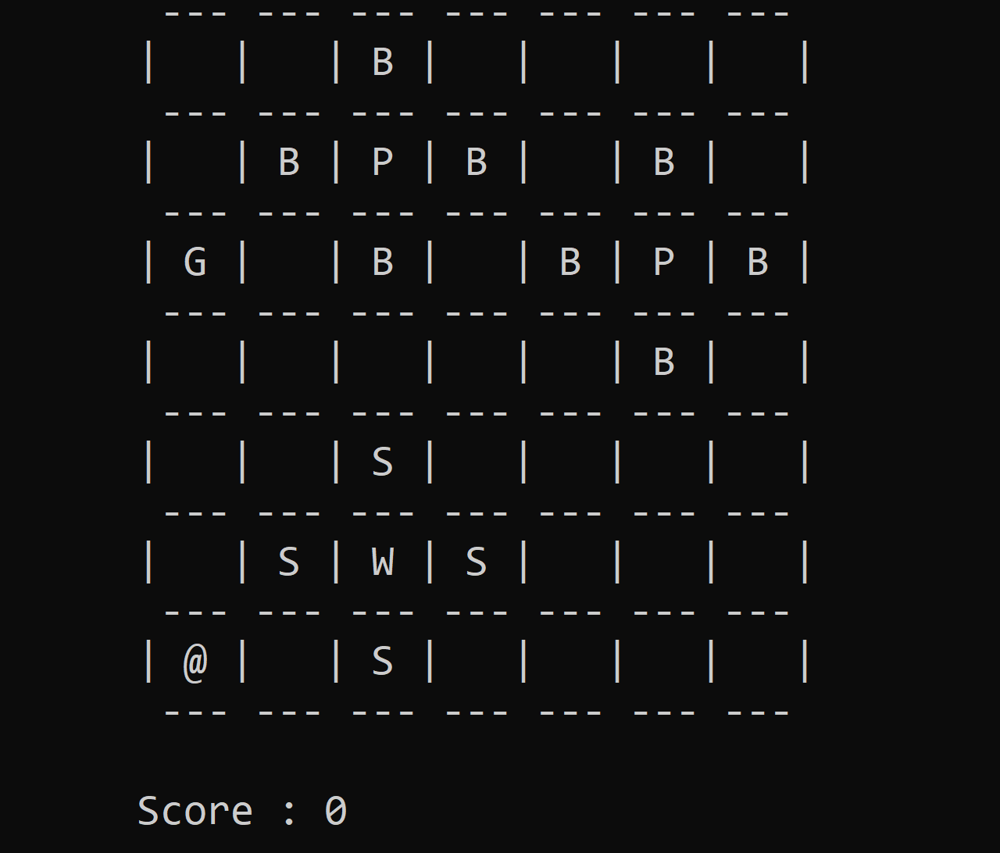

# Wumpus World Game

Welcome to the adventurous world of Wumpus! 🌍🐉

## Gameplay

In this classic text-based game, you'll embark on a thrilling journey to find the hidden gold while avoiding deadly pits and the fearsome Wumpus. Explore the grid, sense the environment, and make strategic moves to achieve victory!

## Instructions

- Use the arrow keys to navigate through the grid.
- Watch out for clues! Stenches indicate the Wumpus's presence, and cold breezes warn of nearby pits.
- Your goal is to collect the gold without falling into pits or getting caught by the Wumpus.
- The game ends if you find the gold, get caught by the Wumpus, or fall into a pit.
- Earn points for each successful move and additional points for collecting gold.

## About the Wumpus World

In the mysterious Wumpus World, you'll encounter various elements:
-  The Wumpus: A deadly creature that lurks in the shadows. Avoid it at all costs!
-  Pits: Treacherous holes that lead to doom. Watch your step!
-  Gold: Shiny and valuable, but also quite dangerous to collect.

## Screenshots

Here are some screenshots to give you a sneak peek of the game:

## How to Run

1. Clone this repository to your local machine.
2. Compile the code using a C++ compiler.
3. Run the executable and embark on your Wumpus adventure!

## Credits

This game is inspired by the classic Wumpus World game and developed by Prakshenjay.

## Feedback and Contributions

We love feedback! If you find any issues or have suggestions, feel free to open an issue or submit a pull request. Let's make the Wumpus World even more exciting together! 🎮🌟

Happy gaming! 🕹️🚀
 
